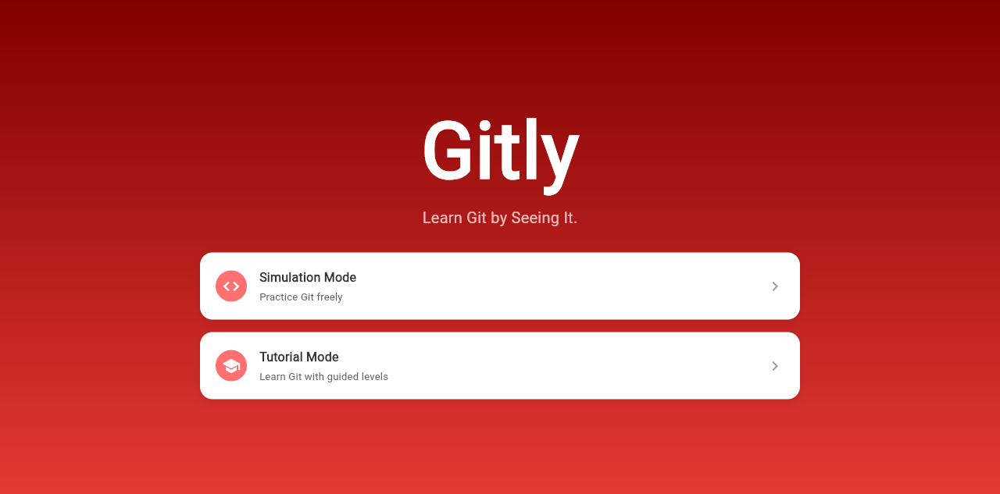
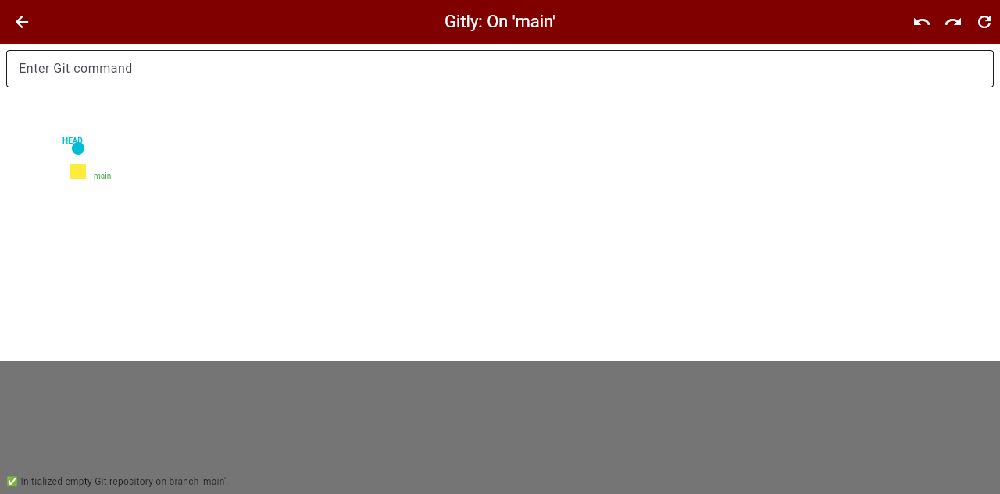
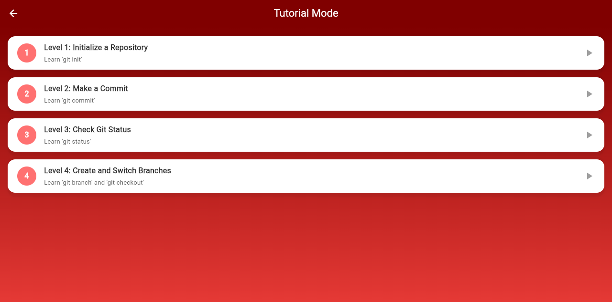
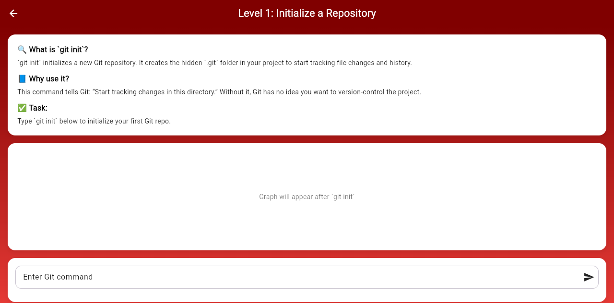

# Gitly

Gitly is an interactive Flutter app that helps beginners learn Git by entering commands and seeing repository history as a visual graph.

## Preview

- **Live demo:** Not deployed yet
- **Repository:** [Gitly on GitHub](https://github.com/ymadz/gitly)
- **Screenshots or GIF:** See the screenshots below

## Overview

Gitly is designed for learners who want a visual introduction to Git concepts such as repositories, commits, branches, checkouts, and merges. It includes a free-form Simulation Mode and a guided Tutorial Mode with short, focused levels.

The app is a client-side Flutter project. Git commands are interpreted by a small in-memory simulation, and the graph is rendered with Flutter's custom painting APIs. There is no server, account system, database, or external API behind the demo.

## Features

- Visual Git graph with commits, parent relationships, branches, and `HEAD`
- Simulation commands for `git init`, `git commit`, `git branch`, `git checkout`, `git merge`, `git log`, `git status`, and reset
- Undo and redo controls for the simulated graph
- Guided lessons for repository initialization, commits, status checks, and branches
- Interactive feedback, console messages, and confetti when tutorial steps are completed

## Screenshots

- **Home screen:**

  

- **Simulation after `git init`:**

  

- **Tutorial level list:**

  

- **Level 1 lesson:**

  

## Tech Stack

### Frontend

- Flutter
- Dart
- Material components and responsive Flutter layouts
- `CustomPaint` and `InteractiveViewer` for the Git graph
- `confetti` for tutorial completion feedback

### Backend and Data

- No backend service
- No database or persistent storage
- All repository state is held in memory for the current session

### Integrations

- No external APIs, authentication providers, payment providers, or storage services

### Tools

- Flutter SDK and `flutter pub`
- `flutter_lints`
- Flutter widget tests
- Chrome for local web verification
- Static Flutter web output suitable for GitHub Pages, Netlify, or a prebuilt Vercel deployment

## My Role

I worked on:

- Building the Flutter screens for the home, simulation, and tutorial flows
- Modeling commits, parent relationships, branches, and `HEAD` in the visual simulator
- Creating the guided Git lessons and their completion feedback
- Restoring the legacy project dependencies, tests, and web metadata
- Verifying the web build and the main user flows in Chrome

## What I Learned

- How to represent Git history as nodes and parent relationships
- How Flutter state updates can drive a custom-painted visualization
- How to structure reusable tutorial screens and interaction feedback
- How to test navigation and core widgets in a Flutter app
- How to restore an older project while preserving its original UI and behavior

## Challenges

- Aligning the old dependency lockfile with the current stable Flutter toolchain
- Updating a stale widget test whose expectations no longer matched the UI
- Keeping graph rendering readable across different screen sizes
- Simulating useful Git behavior without a real repository or backend
- Preserving the original project scope instead of turning it into a larger rewrite

## Future Improvements

- Add more command validation and synchronize all simulator state with undo/redo
- Persist lesson progress between sessions
- Add automated tests for command parsing and the tutorial completion flows
- Improve semantics and responsive behavior for accessibility and smaller screens
- Add and wire a fifth tutorial level; the current `level5_screen.dart` placeholder is not exposed
- Publish a live web build and add a short demo GIF to the repository

## Installation

### Prerequisites

- Flutter stable SDK 3.35.7 or a compatible version with Dart 3.5.2+
- Dart SDK (included with Flutter)
- Git
- Chrome for the web demo

### Setup

```bash
git clone https://github.com/ymadz/gitly.git
cd gitly/gitly
flutter pub get
```

Start the web app:

```bash
flutter run -d chrome --web-port 7357
```

The app runs at:

```text
http://localhost:7357
```

Useful commands:

```bash
flutter pub get                    # Install Dart and Flutter packages
flutter run -d chrome              # Start the web app
flutter build web --release        # Build the production web output
flutter test                       # Run widget tests
flutter analyze                    # Run Dart and Flutter analysis
```

## Environment Variables

No environment variables are required. The current demo runs entirely in the client and uses no secrets or external services.

```env
# No environment variables required
```

Do not commit environment files or secret keys if external services are added later.

## Project Status

**Portfolio archive / functional demo.**

The home screen, Simulation Mode, Tutorial Mode, Levels 1–4, widget tests, and release web build currently work. A fifth tutorial screen is only an empty placeholder and is not exposed in the UI. The app is safe to use as a client-side demo, but it does not persist data and is not intended to replace Git or serve as a production repository manager. The analyzer reports only non-blocking style and API-deprecation information from the older source.

For deployment, the simplest path is to publish the generated `gitly/build/web` directory through GitHub Pages or Netlify. Vercel can also host the static output, but its Git build needs a Flutter SDK setup or a prebuilt-output deployment; no Vercel project or credentials are configured in this repository.

## Acknowledgements

- [Flutter](https://flutter.dev/) and the Dart SDK
- [`confetti`](https://pub.dev/packages/confetti) for tutorial completion effects
- Flutter Material icons and the official Flutter documentation
